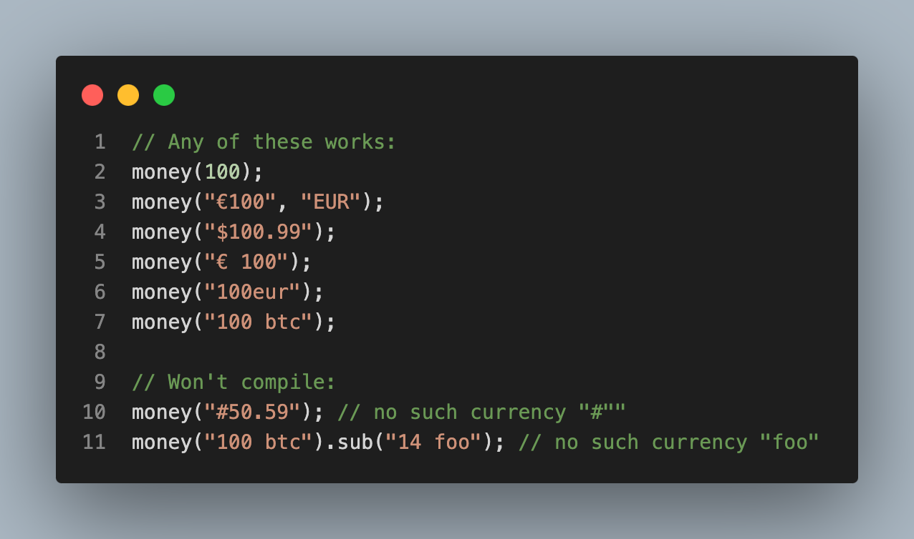
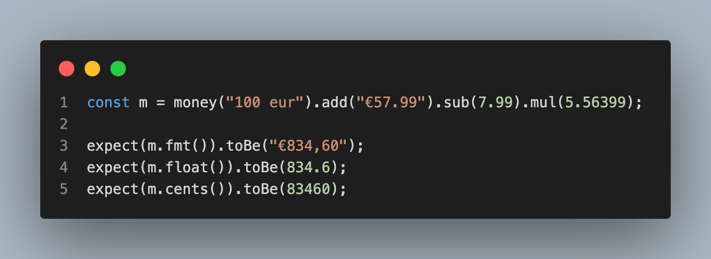
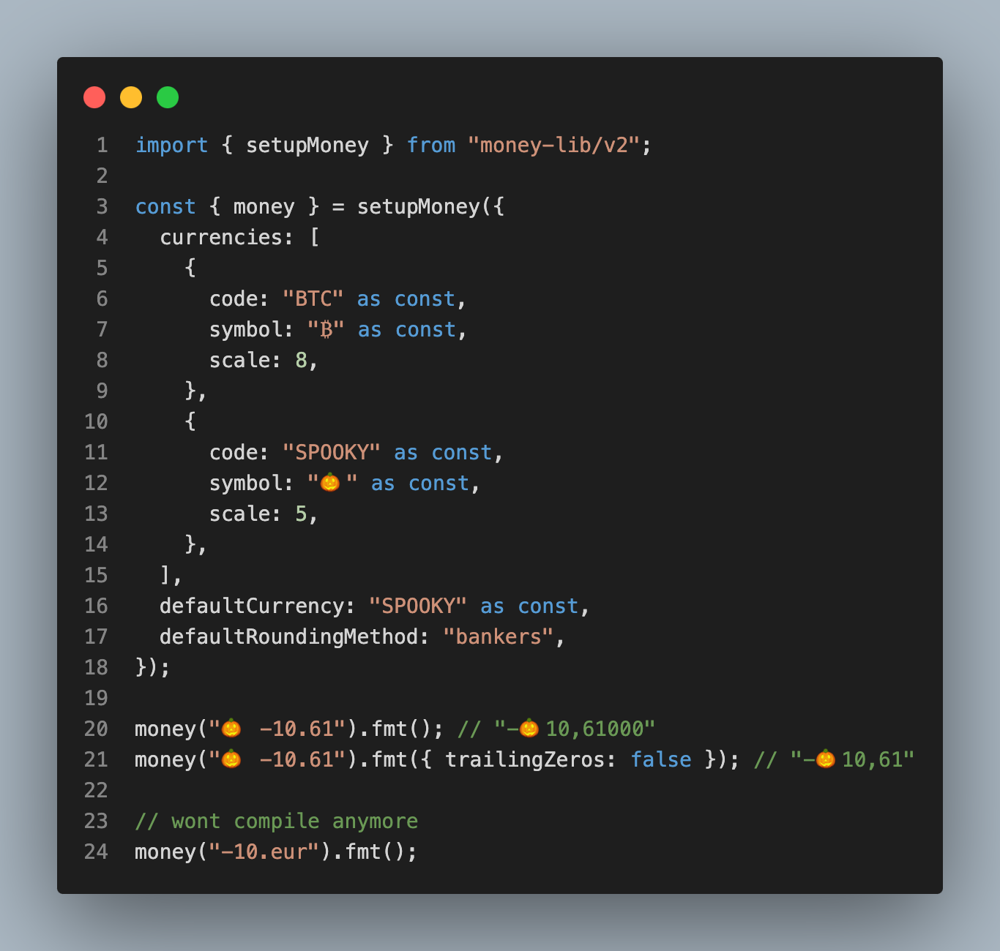
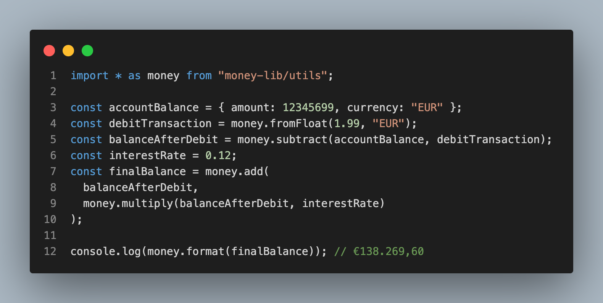

# 💰 money-lib 💰

### TypeScript library to work with money

[](https://www.npmjs.com/package/money-lib)

This is V2 API. V1 docs are [here](README_V1.md).

<br/>

Simple API

<p>
  
</p>
<br/>

Type safe

<p>
  
</p>
<br/>

Correct rounding (Banker's by default)

<p>
  
</p>
<br/>

Custom currencies

<p>
  
</p>
<br/>

Standalone utils

<p>
  
</p>
<br/>

### API

```ts
// Compare
cmp: (m) => 1 | 0 | -1;

// Equal
eq: (m) => boolean;

// Greater than
gt: (m) => boolean;

// Greater than or equal
gte: (m) => boolean;

// Less than
lt: (m) => boolean;

// Less than or equal
lte: (m) => boolean;

// Check if a Money is zero
is0: () => boolean;

// Check if a Money is positive
isPos: () => boolean;

// Check if a Money is negative
isNeg: () => boolean;

// Get min from multiple Money inputs
min: (...m) => m;

// Get max from multiple Money inputs
max: (...m) => m;

// Check if a Money is valid
validate: () => boolean;

// Split Money into a whole and cents part
split: () => {
  base: number;
  cents: number;
};

// Add multiple Money inputs
add: (...m) => m;

// Subtract multiple Money inputs
sub: (...m) => m;

// Multiply Money by a number
mul: (multiplier: number, round?: (n: number) => number) => m;

// Divide Money by a number
div: (divider: number, round?: (n: number) => number) => m;

// Return the absolute value of a Money
abs: () => m;

// Format Money
fmt: (ops?: {
  locale?: string;
  cents?: boolean;
  trailingZeros?: boolean;
  withPlusSign?: boolean;
}) => string;

// Advanced Money formatter
fmts: (locale?: string) => {
  whole: string;
  wholeFormatted: string;
  cents: string;
  currencySymbol: string;
  decimalSeparator: string;
  sign: "+" | "-" | "";
};

// Parse a string into a Money object
parse: (
  s: string,
  currency: string,
  locale?: string,
  decimalSeparator?: "." | ","
) => m;

// Log a Money object to the console
debug: (prefix?: string) => m;

// Return the Money object
json: () => Money;

// Return the Money object as an int
int: () => Cents;

// Return the Money object as an int (alias for toInt)
cents: () => Cents;

// Return the Money object as a float
number: () => number;

// Return the Money object as a float (alias for number())
float: () => number;

// Return the Money object as a string
centStr: () => string;

// Return the Money object as a string
string: () => string;
```

### TODO

- big numbers
- support fractions with more than 2 digits eg 1.9999 euros (currently rounds to 2 decimals) (eg for stock prices etc)
