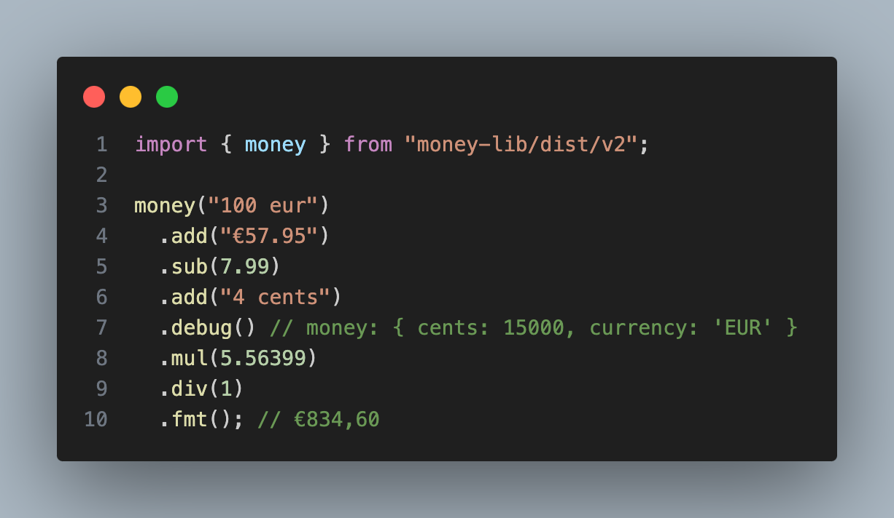

# 💰 money-lib 💰

### TypeScript library to work with money

[](https://www.npmjs.com/package/money-lib)

```ts
import { money } from "money-lib/v2";

money("100 eur")
  .add("€57.99")
  .sub(7.99)
  .debug() // money: { amount: 15000, currency: 'EUR' }
  .mul(5.56399)
  .div(5.56399)
  .fmt(); // €150,00
```

<p>
  
</p>

<details>
  <summary>extend currencies</summary>

```ts
import { setupMoney } from "money-lib/v2";

const { money } = setupMoney({
  currencies: [
    {
      code: "SPOOKY" as const,
      symbol: "🎃" as const,
      scale: 5,
    },
  ],
  defaultCurrency: "EUR" as const,
  defaultRoundingMethod: "bankers",
});

// money("-10.61eur").fmt() - wont compile, unknown currency

money("🎃 -10.61").fmt(); // "-🎃10,61000"

money("0.15 spooky").fmt({ trailingZeros: false }); // "🎃0,15"
```

</details>
<br/>

<details>
  <summary>or as standalone functions</summary>

```ts
import * as money from "money-lib/utils";

const accountBalance = { amount: 12345699, currency: "EUR" };
const debitTransaction = money.fromFloat(1.99, "EUR");
const balanceAfterDebit = money.subtract(accountBalance, debitTransaction);
const interestRate = 0.12;
const finalBalance = money.add(
  balanceAfterDebit,
  money.multiply(balanceAfterDebit, interestRate)
);

console.log(money.format(finalBalance)); // €138.269,60
```

</details>
<br/>

### API

```ts
{
  /**
   * Compare
   */
  cmp: (m: MC<CC, CS>) => 1 | 0 | -1;

  /**
   * Equal
   */
  eq: (m: MC<CC, CS>) => boolean;

  /**
   * Greater than
   */
  gt: (m: MC<CC, CS>) => boolean;

  /**
   * Greater than or equal
   */
  gte: (m: MC<CC, CS>) => boolean;

  /**
   * Less than
   */
  lt: (m: MC<CC, CS>) => boolean;

  /**
   * Less than or equal
   */
  lte: (m: MC<CC, CS>) => boolean;

  /**
   * Check if a Money is zero
   */
  is0: () => boolean;

  /**
   * Check if a Money is positive
   */
  isPos: () => boolean;

  /**
   * Check if a Money is negative
   */
  isNeg: () => boolean;

  /**
   * Get min from multiple Money inputs
   */
  min: (m1: MC<CC, CS>, ...m: MC<CC, CS>[]) => ChainedMoneyV2<CC, CS>;

  /**
   * Get max from multiple Money inputs
   */
  max: (m1: MC<CC, CS>, ...m: MC<CC, CS>[]) => ChainedMoneyV2<CC, CS>;

  /**
   * Check if a Money is valid
   */
  validate: () => boolean;

  /**
   * Split Money into a whole and cents part
   */
  split: () => {
    base: number;
    cents: number;
  };

  /**
   * Add multiple Money inputs
   */
  add: (m1: MC<CC, CS>, ...m: MC<CC, CS>[]) => ChainedMoneyV2<CC, CS>;

  /**
   * Subtract multiple Money inputs
   */
  sub: (m1: MC<CC, CS>, ...m: MC<CC, CS>[]) => ChainedMoneyV2<CC, CS>;

  /**
   * Multiply Money by a number
   */
  mul: (
    multiplier: number,
    round?: (n: number) => number
  ) => ChainedMoneyV2<CC, CS>;

  /**
   * Divide Money by a number
   */
  div: (
    divider: number,
    round?: (n: number) => number
  ) => ChainedMoneyV2<CC, CS>;

  /**
   * Return the absolute value of a Money
   */
  abs: () => ChainedMoneyV2<CC, CS>;

  /**
   * Format Money
   */
  fmt: (ops?: {
    locale?: string;
    /**
     * default: true; if false, 00 cents will be omitted
     */
    cents?: boolean;
    /**
     * default: true; if false, 1.50 will be formatted as 1.5
     */
    trailingZeros?: boolean;
    /**
     * default: false; if true, positive numbers will be prefixed with a plus sign
     */
    withPlusSign?: boolean;
  }) => string;

  /**
   * Advanced Money formatter
   */
  fmts: (locale?: string) => {
    whole: string;
    wholeFormatted: string;
    cents: string;
    currencySymbol: string;
    decimalSeparator: string;
    sign: "+" | "-" | "";
  };

  /**
   * Parse a string into a Money object
   */
  parse: (
    s: string,
    currency: string,
    locale?: string,
    decimalSeparator?: "." | ","
  ) => ChainedMoneyV2<CC, CS>;

  /**
   * Log a Money object to the console
   */
  debug: (prefix?: string) => ChainedMoneyV2<CC, CS>;

  /**
   * Return the Money object
   */
  json: () => Money;

  /**
   * Return the Money object as an int
   */
  int: () => Cents;

  /**
   * Return the Money object as an int (alias for toInt)
   */
  cents: () => Cents;

  /**
   * Return the Money object as a float
   */
  number: () => number;

  /**
   * Return the Money object as a float (alias for number())
   */
  float: () => number;

  /**
   * Return the Money object as a string
   */
  centStr: () => string;

  /**
   * Return the Money object as a string
   */
  string: () => string;

  [symbolChain]: true;
}
```

### TODO

- big numbers
- support fractions with more than 2 digits eg 1.9999 euros (currently rounds to 2 decimals) (eg for stock prices etc)
- simplified api
